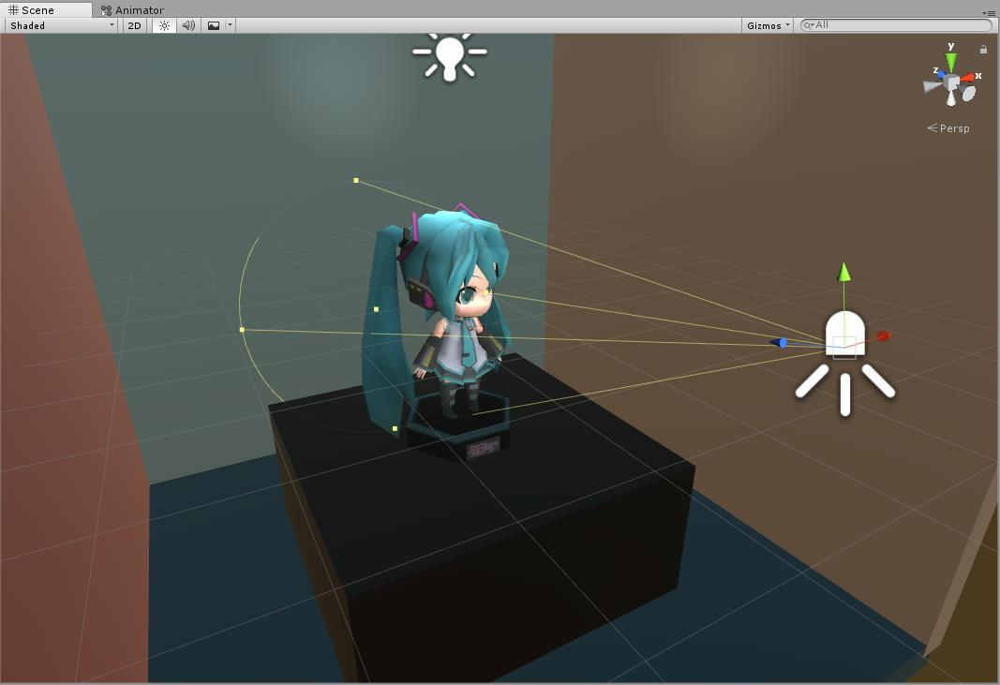

# Unity.Graphics

## 概覽

Unity.Graphics playground

## Reference

+ [Manual GraphicsOverview](https://docs.unity3d.com/Manual/GraphicsOverview.html)
+ [tutorials graphics](https://unity3d.com/cn/learn/tutorials/s/graphics)
+ [Models Reference](./Documents/Models.md)